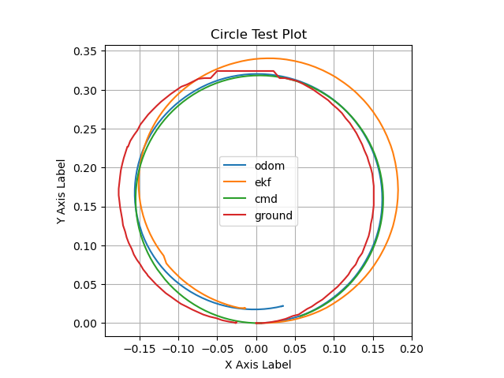

. ROS2_pkg_cpp_py/install_pkg.bash {YOUR_WORKSPACE} {PACKAGE_NAME}
<!-- Serial Mode -->

ros2 run micro_ros_agent micro_ros_agent serial --dev /dev/ttyUSB0 -b 115200
board_microros_transport = serial
<!-- WIFI Mode -->

ros2 run micro_ros_agent micro_ros_agent udp4 --port 8888
board_microros_transport = wifi


# FRA532 EXAM
## 1. Getting Started
## 1.1 Intallation package
To installation this project

```bash
git clone https://github.com/tanakon-apit/FRA532EXAM_31_62.git
cd FRA532EXAM_31_62
colcon build
source install/setup.bash
```
To automate workspace setup every time you open a new terminal, add the following line to your `~/.bashrc` or `~/.bash_profile` file:

```bash
echo "source ~/your_workspace/install/setup.bash" >> ~/.bashrc
source ~/.bashrc
```

## 1.2 Run Visualization Rviz.
To start setup robot by run

For Serial Mode

```bash
$ ros2 run micro_ros_agent micro_ros_agent serial --dev /dev/ttyUSB0 -b 115200
```

For Wifi Mode

```bash
$ ros2 run micro_ros_agent micro_ros_agent udp4 --port 8888
```

To start Run Visualization you can run launch file

```bash
$ ros2 launch robot_bridge robot_bridge.launch.py 
```

To using keyboard to control robot
```bash
$ ros2 run teleop_twist_keyboard teleop_twist_keyboard 
```

To setting via-point to control robot
```bash
$ /bin/python3 ~FRA532EXAM_WS_31_62/src/robot_bridge/scripts/via_points_generator.py
```

# 2. System overview
## 2.1 system_interface_diagram


### Block Description

white box: hardware/ package / exacutable file

green box: subscript topic

blue box: publish topic

yellow box: tf

purple box: tunning parameter

### Back ground color Description

Orang back ground: Commanding part

Green back ground: Processing part

Blue back ground: Display part

## 2.2 rqt_graph 
```bash
rqt_graph
```


## 5. Experiments

### 5.1 Find relationship between motor command & real output of Dynamixel

### 5.2 Find relationship between the values generated by the robot and the values of Wheel Odometry.

### 5.3 EKF Covariance Adjustment of Wheel Odometry and IMU

### 5.4 Motion Following at different scenario

1) Rectangle


2) Circle



3) Half-circle


### Condition 1: Evaluation in Condition of No Additional Obstacles

1. Evaluating Robot Movement Narrow / Wide Doorway 

2. Evaluating Robot Movement Narrow / Wide Pathways 

3. Evaluating Robot Movement in Narrow Angles / Compact Spaces

### Video of Modify VFF Algorithm Testing

&emsp;&emsp;&emsp;&emsp;&emsp;&emsp;&emsp; [](https://www.youtube.com/watch?v=Tkn7DVA4PY4)

### Video of Modify VFF Algorithm Testing

&emsp;&emsp;&emsp;&emsp;&emsp;&emsp;&emsp; [](https://www.youtube.com/watch?v=JB25mcsy4QA)

### Condition 2: Evaluation in Condition of Additional Obstacles

1. Evaluating Robot Movement in the middle of Wide Pathways with (Cylindrical / Cube)


3. Evaluating Robot Movement offset from the middle of Wide Pathways with (Cylindrical / Cube)


5. Evaluating Robot Movement at the corner with (Cylindrical / Cube)


### 5.2 Comparing Result between Standard VFF Algorithm & Modify VFF Algorithm

### Condition 1: Moving Forward 1 m then Backward 1 m

| x [actual] | y [actual] | x [estimated]| y_real [estimated]| x [error] | y [error] | x [square error] | y [square error]
| :---: | :---:| :---: | :---: | :---: | :---:| :---: | :---: |
| 0 | 0 | 0 | 0 | 0 | 0 | 0 | 0 |
| 0 | 0 | 0 | 0 | 0 | 0 | 0 | 0 |
| 0 | 0 | 0 | 0 | 0 | 0 | 0 | 0 |
| 0 | 0 | 0 | 0 | 0 | 0 | 0 | 0 |
| 0 | 0 | 0 | 0 | 0 | 0 | 0 | 0 |
| 0 | 0 | 0 | 0 | 0 | 0 | 0 | 0 |
| 0 | 0 | 0 | 0 | 0 | 0 | 0 | 0 |
| 0 | 0 | 0 | 0 | 0 | 0 | 0 | 0 |
| 0 | 0 | 0 | 0 | 0 | 0 | 0 | 0 |
| 0 | 0 | 0 | 0 | 0 | 0 | 0 | 0 |

| x [rmse] | y [rmse] |
| :---: | :---: |
| 0 | 0 |
| 0 | 0 |

### Condition 2: Moving as a Rectangel 1 m^2 

Odom 

| x [actual] | y [actual] | x [estimated]| y_real [estimated]| x [error] | y [error] | x [square error] | y [square error]
| :---: | :---:| :---: | :---: | :---: | :---:| :---: | :---: |
| 0 | 0 | 0 | 0 | 0 | 0 | 0 | 0 |
| 0 | 0 | 0 | 0 | 0 | 0 | 0 | 0 |
| 0 | 0 | 0 | 0 | 0 | 0 | 0 | 0 |

| x [rmse] | y [rmse] |
| :---: | :---: |
| 0 | 0 |
| 0 | 0 |  

Odom + Gyro 

cov: odom yaw [0.1]

| x [actual] | y [actual] | x [estimated]| y_real [estimated]| x [error] | y [error] | x [square error] | y [square error]
| :---: | :---:| :---: | :---: | :---: | :---:| :---: | :---: |
| 0 | 0 | 0 | 0 | 0 | 0 | 0 | 0 |
| 0 | 0 | 0 | 0 | 0 | 0 | 0 | 0 |
| 0 | 0 | 0 | 0 | 0 | 0 | 0 | 0 |

| x [rmse] | y [rmse] |
| :---: | :---: |
| 0 | 0 |
| 0 | 0 |  

Odom + Gyro

cov: odom yaw [1.00E-6]

| x [actual] | y [actual] | x [estimated]| y_real [estimated]| x [error] | y [error] | x [square error] | y [square error]
| :---: | :---:| :---: | :---: | :---: | :---:| :---: | :---: |
| 0 | 0 | 0 | 0 | 0 | 0 | 0 | 0 |
| 0 | 0 | 0 | 0 | 0 | 0 | 0 | 0 |
| 0 | 0 | 0 | 0 | 0 | 0 | 0 | 0 |

| x [rmse] | y [rmse] |
| :---: | :---: |
| 0 | 0 |
| 0 | 0 |  

Odom + Gyro

cov: odom yaw [1.00E-9]

| x [actual] | y [actual] | x [estimated]| y_real [estimated]| x [error] | y [error] | x [square error] | y [square error]
| :---: | :---:| :---: | :---: | :---: | :---:| :---: | :---: |
| 0 | 0 | 0 | 0 | 0 | 0 | 0 | 0 |
| 0 | 0 | 0 | 0 | 0 | 0 | 0 | 0 |
| 0 | 0 | 0 | 0 | 0 | 0 | 0 | 0 |

| x [rmse] | y [rmse] |
| :---: | :---: |
| 0 | 0 |
| 0 | 0 |  

Odom + Gyro + Accel

cov: odom x [1.00E-6] / odom yaw [0.1]

| x [actual] | y [actual] | x [estimated]| y_real [estimated]| x [error] | y [error] | x [square error] | y [square error]
| :---: | :---:| :---: | :---: | :---: | :---:| :---: | :---: |
| 0 | 0 | 0 | 0 | 0 | 0 | 0 | 0 |
| 0 | 0 | 0 | 0 | 0 | 0 | 0 | 0 |
| 0 | 0 | 0 | 0 | 0 | 0 | 0 | 0 |

| x [rmse] | y [rmse] |
| :---: | :---: |
| 0 | 0 |
| 0 | 0 |  

### Conclusion

From the experiments in case 1, which tested the capabilities of navigation in various points such as tight corners or narrow pathways, it was found that our Modified VFF performed better than the general VFF. This is because it can navigate well in narrow paths, including the ability to reverse out of tight corners, which the general VFF cannot do. As for case 2, both algorithms are able to avoid cylindrical obstacles well, except when they are positioned at the apex of a curve. This is because the repulsive force cannot counteract the attractive force. However, neither algorithm can avoid rectangular obstacles because the repulsive force is insufficient to prevent collisions during evasion maneuvers. The reason for not being able to increase the repulsive force is because it would hinder the robot from navigating narrow passages. Therefore, it can be concluded that the VFF algorithm is not suitable for narrow pathways.


